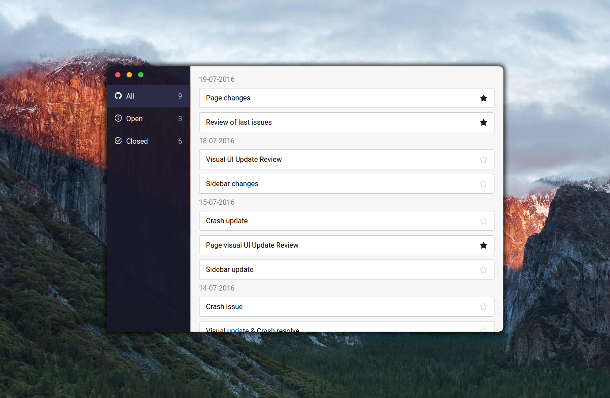

# GitHub Manager

### Overview

GitHub Manager is a FrontEnd application that allows users to fetch and manage GitHub issues for a specific project.<br/>
The ajax call to GitHub API is simulated using a mock 'data.json' file the issues.<br/><br/>

<br/>

The user interface is really intuitive and clean. <br/><br/>

### Install

To install and run the project:
```
git clone https://github.com/L-oris/Github_Manager.git
cd Github_Manager
npm install
npm start
```
